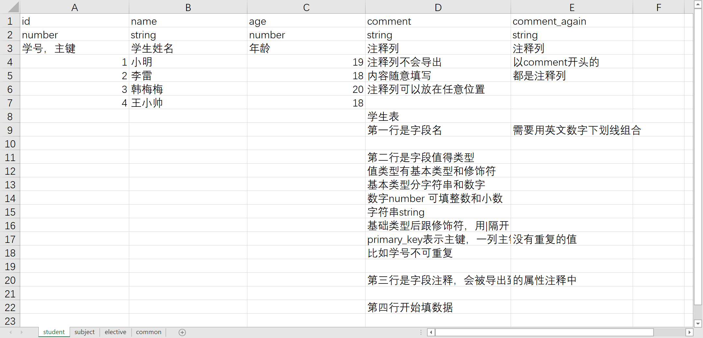
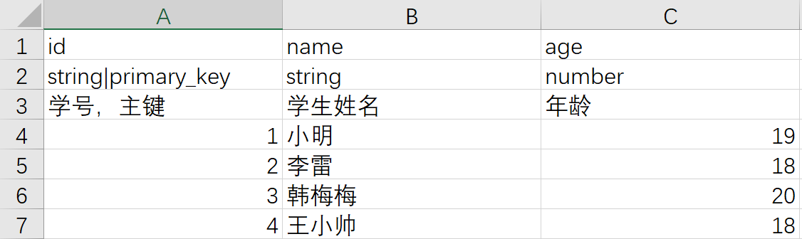
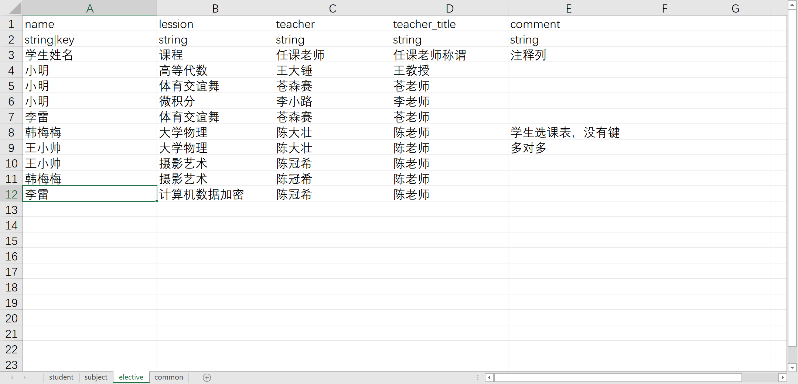
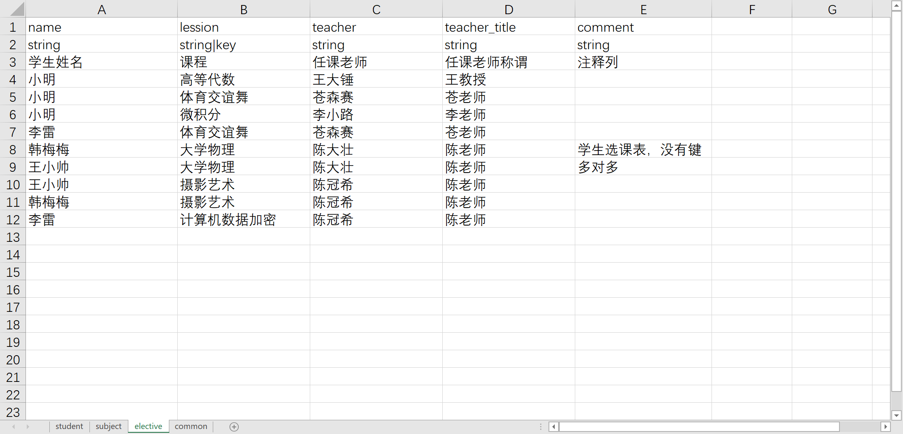
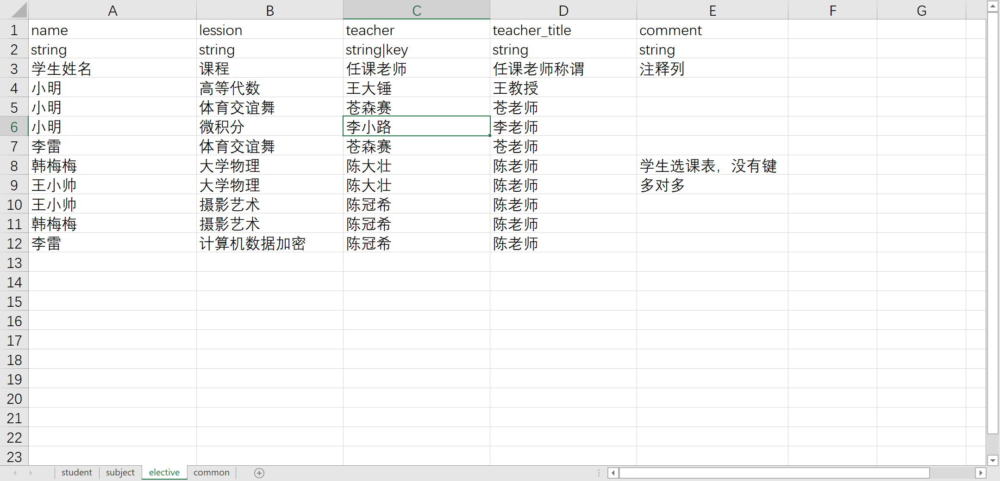
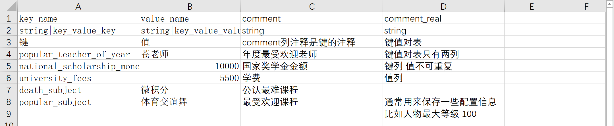

# Excel表格式说明
excel表中的sheet名字要为英文下划线数字组合，sheet名在ts中作为结构体interface名字。

## 基本表（sheet）结构

表第一行是字段名，需要用英文数字下划线组合。

第二行是字段值类型。
值类型分基本类型和修饰符。基本类型分字符串和数字（string，number）。基础类型后跟修饰符，用|隔开。

第三行是字段注释，作为ts结构体属性的注释。

第四行开始填数据。

comment开头的列是注释列，可以填写一些注释说明，不会导出。

## 数据结构修饰符

数据结构修饰符可以给表定义键值数据结构，有key、primary_key、key_value_key和key_value_value键对。一个表最多只能设置一个键列（key、primary_key、key_value_key）。

建议程序定义好表结构，策划填值。

以学生表为例。

### 不使用数据结构修饰符
学生表不使用数据结构修饰符。

导出的json没有键值结构：
```javascript
{
    "student":[
        {
            "age":19,
            "id":1,
            "name":"小明"
        },
        {
            "age":18,
            "id":2,
            "name":"李雷"
        },
        {
            "age":20,
            "id":3,
            "name":"韩梅梅"
        },
        {
            "age":18,
            "id":4,
            "name":"王小帅"
        }
    ]
}
```
### 使用数据结构修饰符primary_key
primary_key表示主键列，键值一对一。主键列这一列值不重复，比如学号是唯一的所有学生的学号不重复。学生表以学号作为主键。



```java
{
    "student":{
        "1":{
            "age":19,
            "name":"小明"
        },
        "2":{
            "age":18,
            "name":"李雷"
        },
        "3":{
            "age":20,
            "name":"韩梅梅"
        },
        "4":{
            "age":18,
            "name":"王小帅"
        }
    }
}
```
### 使用数据结构修饰符key

key表示一对多键列。以学生选课表为例，多对多时给不同的列设置键列会有不同的含义和结果。
#### 学生的选课列表
设置学生姓名为键列。

```java
{
    "elective":{
        "小明":[
            {
                "lession":"高等代数",
                "teacher":"王大锤",
                "teacher_title":"王教授"
            },
            {
                "lession":"体育交谊舞",
                "teacher":"苍森赛",
                "teacher_title":"苍老师"
            },
            {
                "lession":"微积分",
                "teacher":"李小路",
                "teacher_title":"李老师"
            }
        ],
        "李雷":[
            {
                "lession":"体育交谊舞",
                "teacher":"苍森赛",
                "teacher_title":"苍老师"
            },
            {
                "lession":"计算机数据加密",
                "teacher":"陈冠希",
                "teacher_title":"陈老师"
            }
        ],
        "王小帅":[
            {
                "lession":"大学物理",
                "teacher":"陈大壮",
                "teacher_title":"陈老师"
            },
            {
                "lession":"摄影艺术",
                "teacher":"陈冠希",
                "teacher_title":"陈老师"
            }
        ],
        "韩梅梅":[
            {
                "lession":"大学物理",
                "teacher":"陈大壮",
                "teacher_title":"陈老师"
            },
            {
                "lession":"摄影艺术",
                "teacher":"陈冠希",
                "teacher_title":"陈老师"
            }
        ]
    }
}
```

#### 课程的学生列表
设置课程为键列。

```java
{
    "elective":{
        "体育交谊舞":[
            {
                "name":"小明",
                "teacher":"苍森赛",
                "teacher_title":"苍老师"
            },
            {
                "name":"李雷",
                "teacher":"苍森赛",
                "teacher_title":"苍老师"
            }
        ],
        "大学物理":[
            {
                "name":"韩梅梅",
                "teacher":"陈大壮",
                "teacher_title":"陈老师"
            },
            {
                "name":"王小帅",
                "teacher":"陈大壮",
                "teacher_title":"陈老师"
            }
        ],
        "微积分":[
            {
                "name":"小明",
                "teacher":"李小路",
                "teacher_title":"李老师"
            }
        ],
        "摄影艺术":[
            {
                "name":"王小帅",
                "teacher":"陈冠希",
                "teacher_title":"陈老师"
            },
            {
                "name":"韩梅梅",
                "teacher":"陈冠希",
                "teacher_title":"陈老师"
            }
        ],
        "计算机数据加密":[
            {
                "name":"李雷",
                "teacher":"陈冠希",
                "teacher_title":"陈老师"
            }
        ],
        "高等代数":[
            {
                "name":"小明",
                "teacher":"王大锤",
                "teacher_title":"王教授"
            }
        ]
    }
}
```
#### 老师的学生课程列表
设置老师名字为键列。

```java
{
    "elective":{
        "李小路":[
            {
                "lession":"微积分",
                "name":"小明",
                "teacher_title":"李老师"
            }
        ],
        "王大锤":[
            {
                "lession":"高等代数",
                "name":"小明",
                "teacher_title":"王教授"
            }
        ],
        "苍森赛":[
            {
                "lession":"体育交谊舞",
                "name":"小明",
                "teacher_title":"苍老师"
            },
            {
                "lession":"体育交谊舞",
                "name":"李雷",
                "teacher_title":"苍老师"
            }
        ],
        "陈冠希":[
            {
                "lession":"摄影艺术",
                "name":"王小帅",
                "teacher_title":"陈老师"
            },
            {
                "lession":"摄影艺术",
                "name":"韩梅梅",
                "teacher_title":"陈老师"
            },
            {
                "lession":"计算机数据加密",
                "name":"李雷",
                "teacher_title":"陈老师"
            }
        ],
        "陈大壮":[
            {
                "lession":"大学物理",
                "name":"韩梅梅",
                "teacher_title":"陈老师"
            },
            {
                "lession":"大学物理",
                "name":"王小帅",
                "teacher_title":"陈老师"
            }
        ]
    }
}
```

### 使用数据结构修饰符key_value_key和key_value_value
key_value_key和key_value_value表示纯键值对，一对修饰符一起使用。纯键值对表除了注释列，只有键列（key_value_key）和值列（key_value_value）。纯键值对表一般用来配置全局定义。比如角色最大等级100，年度最受欢迎老师苍老师。

```java
{
    "common":{
        "death_subject":"微积分",
        "national_scholarship_money":10000.0,
        "popular_subject":"体育交谊舞",
        "popular_teacher_of_year":"苍老师",
        "university_fees":5500.0
    }
}
```


